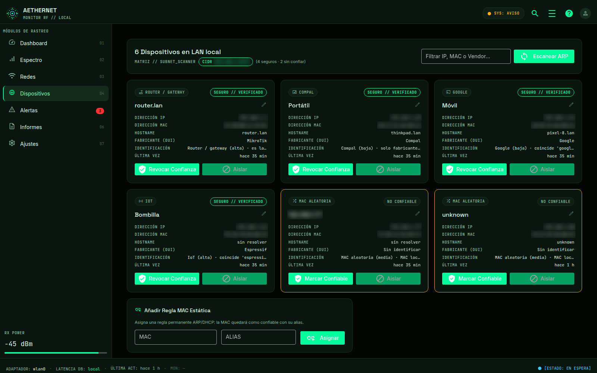
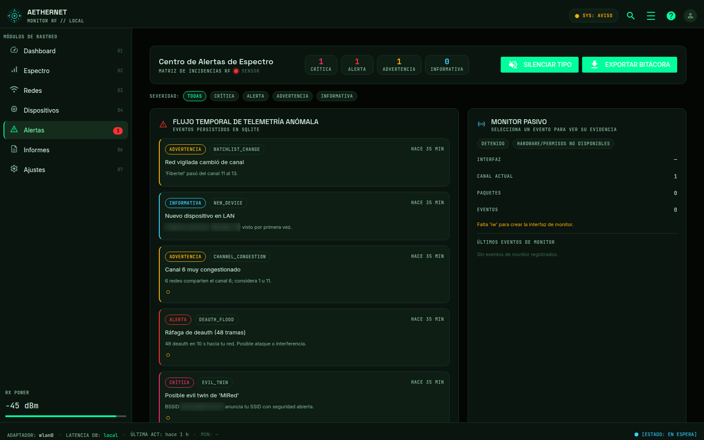
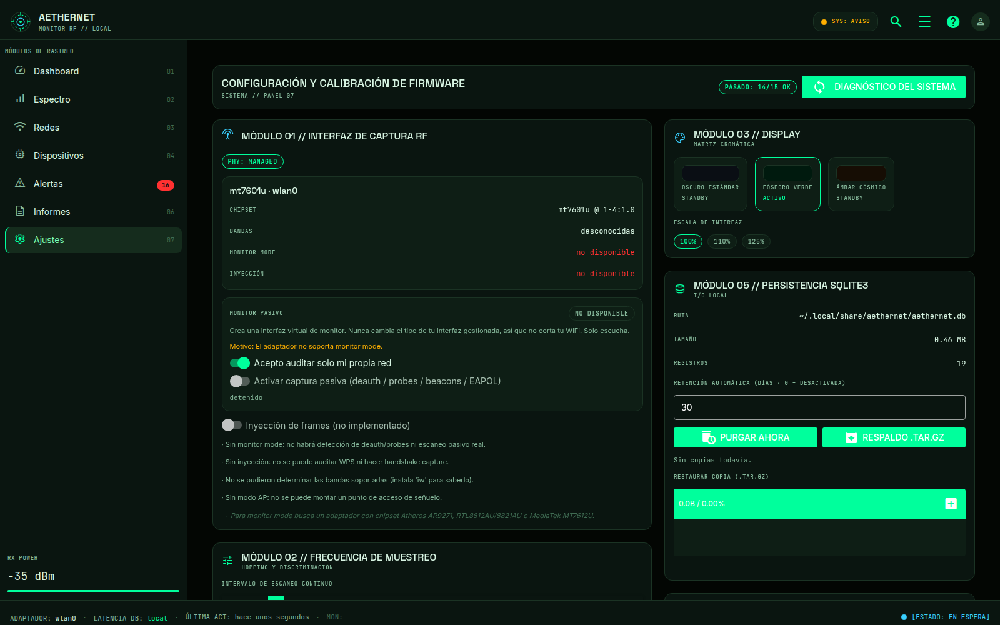
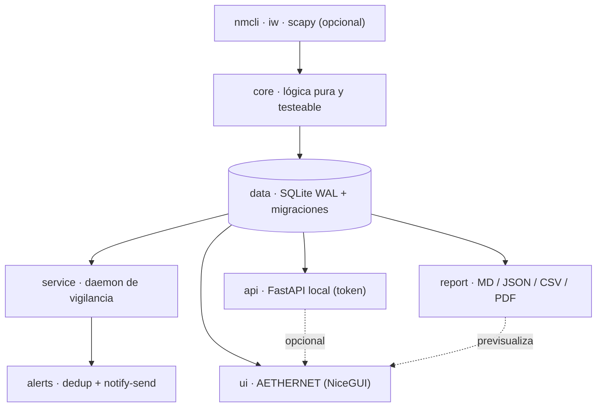

<div align="center">

# AETHERNET

**Instrumento local para auditar tu WiFi doméstico.**
Pasivo por defecto · sin nube · sin telemetría · honesto con tu hardware.

[](https://github.com/yosoyignicion/Aethernet/actions/workflows/ci.yml)
[](#requisitos)
[](LICENSE)
[](#calidad)
[](CONTRIBUTING.md)

[Guía de uso](docs/GUIA_USO.md) · [Roadmap](docs/ROADMAP.md) · [Changelog](CHANGELOG.md) · [Contribuir](CONTRIBUTING.md) · [Seguridad](SECURITY.md)


</div>

Aethernet mide tu entorno WiFi, detecta solapamiento de canales y dispositivos
desconocidos en tu LAN y —solo si lo pides— captura tramas de gestión. No es un
script con botones pegados: es una arquitectura en capas con **CLI + API local +
interfaz gráfica `AETHERNET`**, que consumen exactamente los mismos servicios.

> Habla de tu red como lo haría un auditor: con datos, no con sustos. Si algo no
> se puede medir, verás `n/d`; nunca un número inventado.

## ¿Por qué Aethernet?

|  |  |
| --- | --- |
| **Pasivo por defecto** | Escuchar no interfiere. Lo activo (ARP, captura) solo corre si lo pides. |
| **Nunca corta tu WiFi** | El monitor usa una interfaz **virtual**; jamás cambia el tipo de tu interfaz gestionada. |
| **Cero nube** | Sin cuenta, sin telemetría, sin red saliente. Fuentes e iconos se sirven en local. |
| **Honesto con el hardware** | `aethernet doctor` da el veredicto real: qué puede y qué no puede hacer tu equipo. |
| **Todo local y portable** | SQLite en rutas XDG y copias `.tar.gz` para mover tu histórico a otra máquina. |
| **Calidad de verdad** | `mypy --strict` sin errores, `vulture` sin código muerto y CI real en 3.11/3.12. |

## Capturas

<div align="center">


*Espectro: potencia por canal, tu red frente a los vecinos, asesor y co-interferencia.*

</div>

<p align="center">
  
  
  <br />
  
  
</p>

> Las capturas muestran MAC e IP difuminadas.

## Características

### Espectro y canales
- **Distribución de potencia** por canal, separando **tu red del entorno**.
- **Asesor de canal 2.4 GHz en vivo**, sobre histórico agregado (no oscila).
- **Previsión por hora y día** para adelantarte a la saturación según el reloj.
- **Gestor de canal**: ranking de los 13 canales con interferencia y disponibilidad.

### Redes e inventario
- Inventario BSSID con búsqueda, filtros (cifradas, abiertas, ocultas, WPS) e inspector.
- **Histórico de señal (RSSI 24 h)** y detección de cambios por red.
- **Lista de vigilancia**: avisa si una red vigilada cambia de canal/seguridad o desaparece.
- Detección de **evil twin** al comparar tu SSID con su BSSID declarado.

### Dispositivos LAN
- Inventario de nodos de tu subred con **confianza**, alias y vendor (OUI).
- Detección de **MAC aleatorizada** y clasificación honesta por fabricante/hostname.
- **Identificar servicios**: sonda activa, bajo petición, que estima el perfil (router,
  impresora, cámara, NAS, IoT…) sin salir de tu LAN.

### Alertas y monitor pasivo
- Motor de reglas con hallazgos accionables (deauth, canal saturado, WPS…).
- Daemon de vigilancia con **deduplicación** y horas silenciosas.
- Monitor pasivo **no disruptivo** (interfaz virtual) para deauth, *probes*, *beacons* y EAPOL,
  con evidencia en hexdump. Sin inyección de tráfico.

### Datos, informes y automatización
- Informes **Markdown / PDF / JSON / CSV** y snapshots comparables.
- **Copia y restauración offline** (`backup` / `restore`): un `.tar.gz` con la base
  consistente, la config y un manifiesto **sin secretos**.
- **API local** opcional (FastAPI) protegida por token, pensada para tus scripts.
- Retención automática del histórico y `--json` en todos los comandos.

## Principios de diseño

1. **Capas sin acoplamiento.** `core/` es lógica pura y testeable **sin hardware ni
   GUI**; `ui/` solo lee la base de datos o consume servicios, nunca los reimplementa.
2. **Dependencias opcionales.** `scapy`, `reportlab`, `matplotlib`, `fastapi` y
   `nicegui` son extras que degradan con gracia; el núcleo no exige ninguno.
3. **Migraciones *append-only*.** Una migración aplicada jamás se edita; se añade
   una nueva. La copia/restauración valida el esquema antes de escribir.
4. **Lógica verificable.** Los *parsers* y las reglas son funciones puras, así que
   el comportamiento crítico se testea sin tocar una tarjeta WiFi.

## Requisitos

Linux con **NetworkManager** (`nmcli`) y **Python 3.11+**. Recomendado: `iw`,
`ethtool`, `notify-send`. `scapy` + `root` habilitan LAN activo y captura; `iw`
habilita *monitor mode*. Todo lo opcional degrada con gracia.

```bash
aethernet doctor        # veredicto honesto de tu hardware
```

## Instalación

```bash
git clone https://github.com/yosoyignicion/Aethernet.git
cd Aethernet
python3 -m venv .venv && source .venv/bin/activate
pip install -e '.[ui]'      # núcleo + interfaz AETHERNET
# o todo: pip install -e '.[all]'
```

Extras disponibles: `lan`, `api`, `reports`, `speedtest`, `ui`, `monitor`, `all`.

## Uso rápido

```bash
# CLI
aethernet doctor                   # ¿qué soporta mi hardware?
aethernet scan --no-lan            # escaneo pasivo
aethernet analyze                  # motor de reglas sobre el último escaneo
aethernet forecast week            # previsión de canal por hora/día
aethernet watch add aa:bb:cc:dd:ee:ff --ssid MiRed   # vigila cambios de una red
aethernet config set my_ssids MiRed
aethernet daemon start             # vigilancia continua

# Copias offline
aethernet backup                   # genera aethernet-backup-FECHA.tar.gz
aethernet restore copia.tar.gz     # recupera en esta o en otra máquina
aethernet restore --verify copia.tar.gz   # dry-run: solo valida

# Interfaz gráfica
aethernet-ui                       # o: python -m aethernet.ui --web --port 8080

# API local (opcional)
aethernet api --print-token        # cabecera X-Aethernet-Token
aethernet api
```

Todos los comandos aceptan `--json`. La guía completa, pantalla por pantalla,
está en **[docs/GUIA_USO.md](docs/GUIA_USO.md)**.

## La interfaz (AETHERNET)

Siete módulos: **Dashboard · Espectro · Redes · Dispositivos · Alertas · Informes · Ajustes**.

| Atajo | Acción |
| --- | --- |
| `1` … `7` | saltar al módulo correspondiente |
| `R` | forzar un ciclo de escaneo |
| `/` o `Ctrl+K` | buscar redes |
| `Ctrl+E` | exportar informe Markdown |
| `C` | copiar tu canal actual |

## Arquitectura



| Capa | Paquete | Responsabilidad |
| --- | --- | --- |
| Core | `aethernet.core` | Lógica pura: parseo `nmcli`/`iw`, ARP, reglas, salud, espectro, OUI, *fingerprint*. |
| Datos | `aethernet.data` | SQLite con WAL, migraciones append-only e histórico. |
| Servicio | `aethernet.service` | Daemon de vigilancia; **nunca dibuja**. |
| Alertas | `aethernet.alerts` | Cola, deduplicación, filtros y `notify-send`. |
| Informes | `aethernet.report` | Exportadores Markdown / JSON / CSV / PDF. |
| API | `aethernet.api` | FastAPI local opcional, protegida por token. |
| UI | `aethernet.ui` | NiceGUI "AETHERNET"; solo lee la DB / consume servicios. |

Los *parsers* son funciones puras (se testean sin hardware) y las dependencias
pesadas son **extras opcionales** con degradación graciosa.

## Privacidad y datos

Sin red saliente: la interfaz sirve fuentes e iconos localmente (`/ae-fonts`). Nada
sale de tu equipo. Todo vive en rutas XDG:

| Qué | Ruta |
| --- | --- |
| Configuración | `~/.config/aethernet/config.toml` |
| Datos y base SQLite | `~/.local/share/aethernet/aethernet.db` |
| Informes | `~/.local/share/aethernet/reports/` |
| Caché OUI | `~/.cache/aethernet/oui.tsv` |

El token de la API sale de `AETHERNET_API_TOKEN` o de un `api.token` con permisos
`0600`; el secreto de sesión de la UI, de `AETHERNET_STORAGE_SECRET`. Nunca se
hardcodean. Las copias **no incluyen secretos**.

## Calidad

```bash
./scripts/ci.sh      # ruff + mypy --strict + vulture + pytest
./scripts/smoke.sh   # E2E UI headless: 7 rutas + monitor status
```

`mypy --strict` (0 errores) y `vulture` (0 en `core/`+`data/`) son parte del gate.
Hay CI en GitHub Actions para Python 3.11 y 3.12.

## Contribuir

Lee **[CONTRIBUTING.md](CONTRIBUTING.md)**. Reglas clave: pasivo por defecto, sin
nube, honestidad (si no se mide, `n/d`), migraciones *append-only* y Conventional
Commits en español.

## Aviso legal

Para auditar **tu propia red**. Auditar redes ajenas sin autorización puede ser
ilegal. El modo activo solo debe usarse en equipos y redes que controles o tengas
permiso explícito para probar.

## Licencia

[MIT](LICENSE) © The Aethernet Authors.
