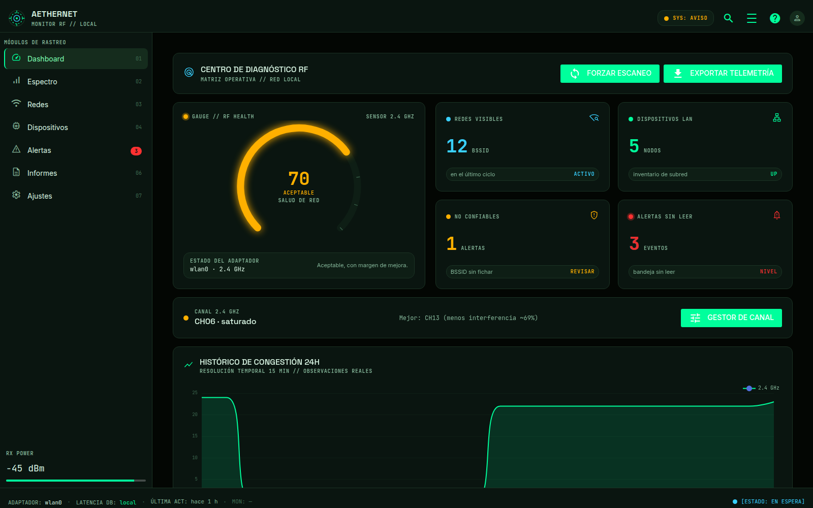
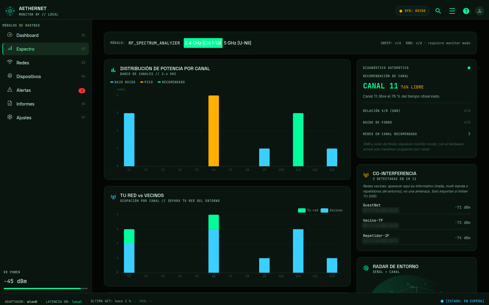
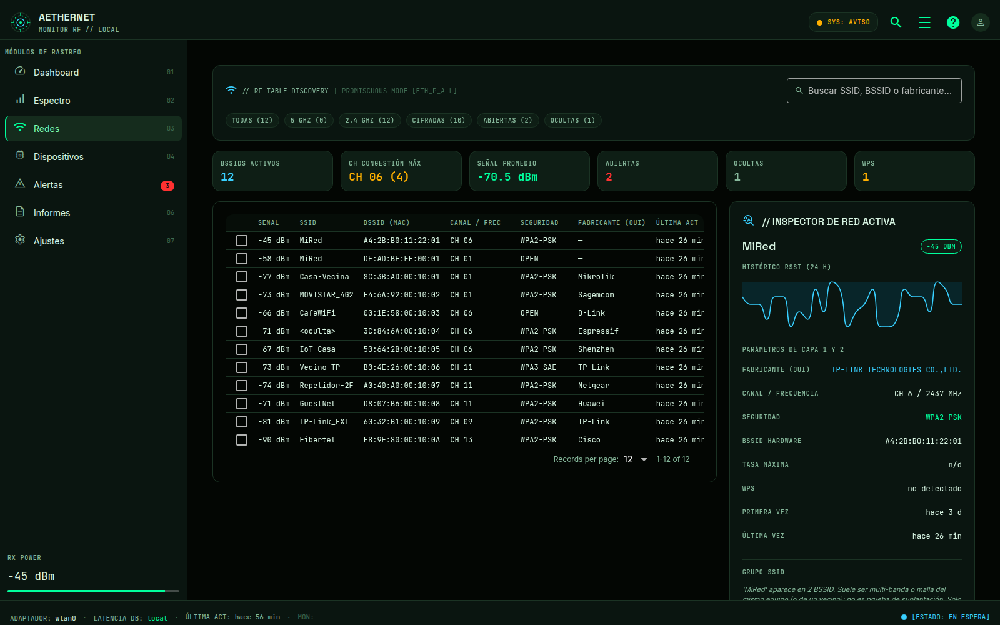

<div align="center">

# Aethernet

**Instrumento local para auditar tu WiFi doméstico.**
Pasivo por defecto · sin nube · sin telemetría · honesto con tu hardware.

[](https://github.com/yosoyignicion/Aethernet/actions/workflows/ci.yml)
[](#requisitos)
[](LICENSE)
[](#calidad)

[Guía de uso](docs/GUIA_USO.md) · [Roadmap](docs/ROADMAP.md) · [Changelog](CHANGELOG.md) · [Contribuir](CONTRIBUTING.md) · [Seguridad](SECURITY.md)

</div>



Aethernet mide tu entorno WiFi, detecta solapamiento de canales y dispositivos
desconocidos en tu LAN, y opcionalmente captura tramas de gestión. No es un
script con botones pegados: es una arquitectura en capas, con CLI + API + una
interfaz gráfica "AETHERNET" que consume exactamente los mismos servicios.

| Espectro | Redes |
| --- | --- |
|  |  |

## Características

- **Escaneo pasivo** con `nmcli`; activo (ARP con `scapy`) solo si lo pides.
- **Motor de reglas** con hallazgos accionables (evil twin, deauth, canal saturado…).
- **Salud de la red** con gauge, histórico de congestión y asesor de canal 2.4 GHz.
- **Inventario LAN** con confianza, alias y detección de MAC aleatoria.
- **Monitor pasivo** no disruptivo (interfaz *virtual*, nunca corta tu WiFi).
- **Informes** Markdown / PDF / JSON / CSV y snapshots comparables.
- **Copia y restauración offline** (`aethernet backup` / `restore`): un `.tar.gz` con la base consistente, la config y un manifiesto; **sin secretos**.
- **Daemon** de vigilancia continua y **alertas** con deduplicación y horas silenciosas.
- **API local** opcional (FastAPI) protegida por token.

## Requisitos

Linux con **NetworkManager** (`nmcli`) y **Python 3.11+**. Recomendado: `iw`,
`ethtool`, `notify-send`. `scapy` + `root` habilitan LAN activo y captura;
`iw` habilita monitor mode. Todo es **opcional y degrada con gracia**.

```bash
aethernet doctor        # veredicto honesto de tu hardware
```

## Instalación

```bash
git clone https://github.com/yosoyignicion/Aethernet.git
cd aethernet
python3 -m venv .venv && source .venv/bin/activate
pip install -e '.[ui]'                                # núcleo + interfaz
# o todo: pip install -e '.[lan,reports,api,speedtest,ui]'
```

## Uso rápido

```bash
# CLI
aethernet scan --no-lan            # escaneo pasivo
aethernet analyze                  # reglas sobre el último escaneo
aethernet networks --open          # inventario filtrado
aethernet config set my_ssids MiRed
aethernet daemon start             # vigilancia continua
aethernet backup                   # copia de seguridad offline (.tar.gz)
aethernet restore copia.tar.gz     # recupérala en esta o en otra máquina

# Interfaz gráfica
aethernet-ui                       # o: python -m aethernet.ui --web --port 8080

# API local (opcional)
aethernet api --print-token        # cabecera X-Aethernet-Token
aethernet api
```

Todos los comandos aceptan `--json`. La guía completa, pantalla por pantalla,
está en **[docs/GUIA_USO.md](docs/GUIA_USO.md)**.

### Atajos de la interfaz

`1`…`7` módulos · `R` escanear · `/` o `Ctrl+K` buscar redes · `Ctrl+E` exportar · `C` copiar canal.

## Arquitectura

| Capa | Paquete | Responsabilidad |
| --- | --- | --- |
| Core | `aethernet.core` | Lógica pura y testeable: parseo `nmcli`/`iw`, ARP, reglas, salud, espectro, OUI. |
| Datos | `aethernet.data` | SQLite con WAL, migraciones e histórico. |
| Servicio | `aethernet.service` | Daemon de vigilancia; **nunca dibuja**. |
| Alertas | `aethernet.alerts` | Cola, deduplicación, filtros y `notify-send`. |
| Informes | `aethernet.report` | Exportadores Markdown / JSON / CSV / PDF. |
| API | `aethernet.api` | FastAPI local opcional. |
| UI | `aethernet.ui` | NiceGUI "AETHERNET"; solo lee la DB / consume servicios. |

Los *parsers* son funciones puras (se testean sin hardware) y las dependencias
pesadas son **extras opcionales** con degradación graciosa.

## Privacidad

Sin red saliente: la interfaz sirve fuentes e iconos localmente (`/ae-fonts`).
Nada sale de tu equipo. Datos en rutas XDG:

- Config: `~/.config/aethernet/config.toml`
- Datos/DB: `~/.local/share/aethernet/aethernet.db`
- Informes: `~/.local/share/aethernet/reports/`

## Calidad

```bash
./scripts/ci.sh      # ruff + mypy --strict + vulture + pytest
./scripts/smoke.sh   # E2E UI headless: 7 rutas + monitor status
```

`mypy --strict` (0 errores) y `vulture` (0 en `core/`+`data/`) son parte del gate.
Hay CI en GitHub Actions para Python 3.11 y 3.12.

## Contribuir

Lee **[CONTRIBUTING.md](CONTRIBUTING.md)**. Reglas clave: pasivo por defecto, sin
nube, honestidad (si no se mide, `n/d`), migraciones append-only y Conventional
Commits en español.

## Aviso legal

Para auditar **tu propia red**. Auditar redes ajenas sin autorización puede ser
ilegal. El modo activo solo en equipos/redes que controles o tengas permiso.

## Licencia

[MIT](LICENSE) © The Aethernet Authors.
